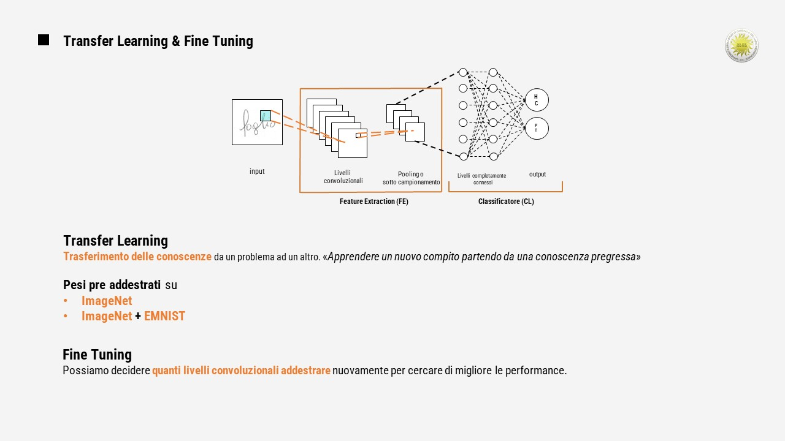

# Diagnosis-of-Neurodegenerative-Diseases-with-the-Employment-of-EfficientNet
Classification of samples by handwriting analysis using a CNN

Scopo del Progetto:
Protocollo sperimentale per studiare la dinamica della grafia, per indagare la presenza di specificità che permettono di distinguere i soggetti affetti da Alzheimer, Pazienti (PT), dai soggetti con controllo sano della grafia (HC - Healthy Control).
A tutti i soggetti è stato richiesto di compiere 25 Task di scrittura manuale, i dati raccolti sono stati catalogati ed elaborati. 
Successivamente, questa mole di dati (immagini) è stata utilizzata per alimentare diversi Modelli di Reti Neurali.

La rete utilizzata è una particolare rete neurale chiamata CONVOLUTIONAL NEURAL NETWORK.
A differenza delle normali reti neurali, questa rete è stata creata appositamente per ricevere in input immagini digitali.
Una CNN si compone fondamentalmente di 2 parti:
La parte dedicata all’estrazione delle caratteristiche , denominata feature extraction e una parte dedicata alla classificazione chiamata classificatore.

Addestrare la parte della rete dedicata all'estraizione delle feature è un lavoro che può richiedere giorni e necessita di un database ben strutturato e formato da migliaia di immagini. Per risolvere questo problema, è stata utilizzata la tecnica del Transfer Learning.

Con il transfer learning, il punto di partenza è una rete già addestrata su problemi generici. In parole semplici, attraverso il tranfer learning, la rete può apprendere un nuovo compito partendo da una conoscenza pregressa; 

In questo lavoro sono stati utilizzati due pre addestramenti:
1. Basato su Imagenet  (database pubblico contente oltre 14 milioni di immagini)
2. Basato sulla combinazione di Imagenet + EMNIST (database pubblico di scrittura manuale contenente numeri e lettere)

Fine Tuning: Si effettua un secondo addestramento della rete, scongelando alcuni livelli convoluzionali al fine di aumentare le performance

La Rete Neurale Convoluzionale utilizzata in questo codice è la EfficientNetB0. 
Attraverso Tensorflow si può cambiare la rete neurale da utilizzare.
