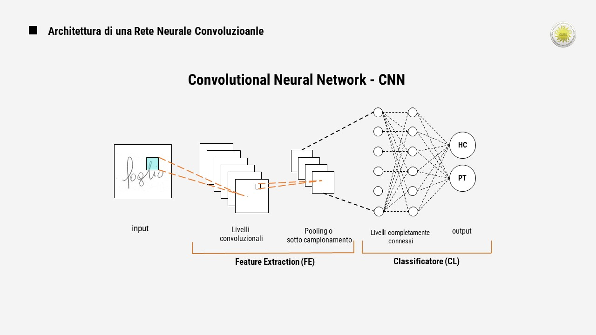

# Diagnosis-of-Neurodegenerative-Diseases-with-the-Employment-of-EfficientNet
Classification of samples by handwriting analysis using a CNN

Scopo del Progetto:
Protocollo sperimentale per studiare la dinamica della grafia, per indagare la presenza di specificità che permettono di distinguere i soggetti affetti da Alzheimer, Pazienti (PT), dai soggetti con controllo sano della grafia (HC - Healthy Control).
A tutti i soggetti è stato richiesto di compiere 25 Task di scrittura manuale, i dati raccolti sono stati catalogati ed elaborati. 
Successivamente, questa mole di dati (immagini) è stata utilizzata per alimentare diversi Modelli di Reti Neurali.

La Rete Neurale Convoluzionale utilizzata in questo codice è la EfficientNetB0. 
Attraverso Tensorflow si può cambiare la rete neurale da utilizzare.
La rete è preaddestrata su imagenet o su pesi estratti personalmente da EMNIST (il file dei pesi non è compreso nella repository)

Il classificatore utilizzato è quello utilie allo scopo del progetto:
2 classi di output: 
  - HC (soggetto sano)
  - PT (soggetto malato)
